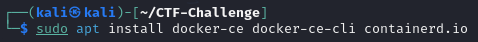
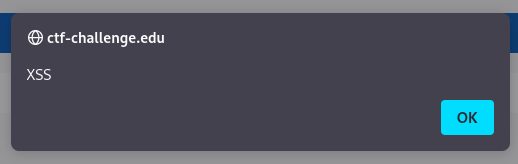
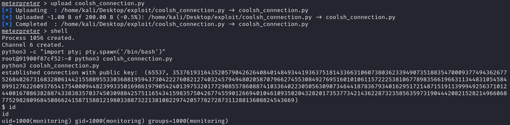
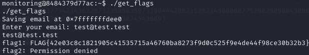

# CTF Challenge Walkthrough

## Setup

### Step 1: Clone the Repository
First, clone the repository to your local machine.

### Step 2: Install Docker
After cloning the repo and reading the `README.md`, you'll need to install `docker-ce` and `docker-ce-cli`.

#### Add Docker Repository Key
Start by adding the Docker repository key.

#### Add Docker Repository
Next, add the Docker repository to your sources.

#### Update Sources
Update your package sources to include the Docker repository.

#### Install Docker
Finally, install Docker using your package manager.

### Step 3: Configure cgroup to Version 1
Run the `change_cgroup_to_v1.sh` script to set the cgroup version to 1.

After running the script, reboot your system to apply the changes.

### Step 4: Setup the Challenge
Once you've rebooted and returned to your host system, run the setup script and wait for the challenge to start.

### Step 5: Configure the Attacking System
After the setup succeeds, you'll be prompted to add your host system's IP with the domain `ctf-challenge.edu` to the `/etc/hosts` file on the system you plan to attack from.

To find an accessible IP address, run `ifconfig` on your host system before switching to the attacking system.

## Beginning the Challenge

### Step 1: Explore the Website
To start the challenge, we should investigate what lies behind the `ctf-challenge.edu` domain.

Navigating to the domain in your preferred browser brings up a simple blog where you can admire some cats.

### Step 2: Test for Cross-Site Scripting (XSS)
As you scroll down, you'll find a comment section. Here, try injecting a simple Cross-Site Scripting (XSS) payload.

It turns out that the XSS payload works!

### Step 3: Investigate Further
Now, we need to find a way to exploit this XSS vulnerability to access the first machine. Clicking on the "Monitoring Service" text in the footer takes you to a page that monitors the status of the website. This suggests there may be another service that loads the site and uses elevated privileges to update the status page.

Next, let's inspect the cookies to gather more clues.

We found a session cookie. If we're lucky, this cookie could be used to update the status page, which likely requires elevated privileges. We can use Burp Suite to inspect how comments are sent to the server. With some luck, we could use the XSS vulnerability to make the monitoring service send its session cookie as a comment so that we can capture it.

### Step 4: Crafting the Payload
Using the information gathered, let's craft a payload (`XSS_payload.txt`) to try and steal the session cookie from the monitoring service by posting it as a comment. After some waiting and refreshing, we should see not only our own session cookie but also another one appear in the comments. It seems our payload was successful!

### Step 5: Hijack the Monitoring Service Session
Replace your own cookie with the stolen session cookie and refresh the site. This action should change the header.

It looks like we've successfully hijacked the monitoring service session! The username now shows as 'monitoring', and a button for an admin panel appears. Clicking on it will lead you to the admin panel.

### Step 6: Upload a Reverse Shell
One of the options, the "Add Page" section, looks particularly promising. Here, let's try uploading a PHP Reverse Shell (e.g., `php-reverse-shell.php` from [Pentestmonkey's repository](https://github.com/pentestmonkey/php-reverse-shell)) to establish a shell connection and access the first machine.

### Step 7: Capture the First Flag
Success! We've established a shell to the first machine. Now, we can run the `get_flag` binary to capture our first flag.

## Pivoting to the Backend

### Step 1: Identify New Targets
After gaining access to the first machine, we should look for additional targets. By reading the `/etc/hosts` file, we discover two new targets: `backend` and `monitoring`.

### Step 2: Route Traffic to New Targets
To continue our attack, we'll use the `autoroute` module in Metasploit to route traffic to these new targets through our existing session.

### Step 3: Set Up a Proxy for External Access
Next, we'll set up a proxy in Metasploit to allow external programs to access these routes.

To utilize this proxy, we need to configure it in our `proxychains4.conf`.

### Step 4: Scan for Open Ports
With the proxy set up, we can use `nmap` to scan the ports of our new targets.

### Step 5: Exploit OpenSSH Vulnerability
The scan of the `backend` server reveals that OpenSSH 7.7 is running, which is vulnerable to a username enumeration exploit. We can verify this using `searchsploit`.

Although there is a Metasploit module for this vulnerability, it tends to crash frequently. Instead, we can use the exploit script provided by `searchsploit`. Note that the first two scripts are written for an older version of the `paramiko` library, so we need to install this library for Python 2 if it's not already installed. 

The exploit is originally designed to test a single username, but we can use the `openssh_exploit.sh` script to iterate through all the usernames in the `unix_users.txt` (can also be found [here](https://github.com/rapid7/metasploit-framework/blob/master/data/wordlists/unix_users.txt)) wordlist provided with the challenge. This script assumes the exploit is in the standard location on Kali Linux, but it can be adapted if you need to download the exploit first (https://www.exploit-db.com/exploits/45939).

After a long wait (due to the lengthy SSH timeout), we finally get a list of valid usernames. Now, we need to find a password.

### Step 6: Analyze the Application Code
Next, let's inspect the `main.py` file for clues. We find that the server establishes a connection to the same `backend` server on the other open port we discovered.

Looking further into the code, we find details on how the database connection is established.

Further down, we observe some peculiar input sanitization occurring on the frontend—a sign that the backend might not be sanitizing input properly.

### Step 7: Perform SQL Injection
With this knowledge, we should look for a function that accepts input and returns output from the database. The `get_username_from_session` function, which uses the `get-username-from-session` action, seems like a good candidate.

Through some trial and error, we can construct the `sql_injection_exploit.py` script. This script allows us to inspect the layout of the database, then the `users` table, and finally, retrieve the interesting `admin` username and its corresponding password hash.

### Step 8: Crack the Password Hash
The retrieved hash can be cracked using tools like `john`, with the provided `unix_passwords.txt` (can also be found [here](https://github.com/rapid7/metasploit-framework/blob/master/data/wordlists/unix_passwords.txt)) wordlist.

### Step 9: Access the Backend Server
We can then use the cracked credentials to connect to the `backend` server via SSH.

### Step 10: Capture the Second Flag
We have successfully accessed the `backend` server! Now, let's generate the second flag and move on to the next part of the challenge.

## Gaining Root Access on the Backend Server

### Step 1: Check Sudo Version
To proceed further in the challenge, our goal is to gain root access on the `backend` server. First, let's check the version of `sudo` to identify a potential attack vector.

### Step 2: Exploit CVE-2019-14287
The `sudo` version on this server is vulnerable to privilege escalation via CVE-2019-14287 (you can read more about it [here](https://cve.mitre.org/cgi-bin/cvename.cgi?name=CVE-2019-14287)). Additionally, the output of `sudo -l` confirms that the sudo configuration on this system meets the criteria necessary to exploit this vulnerability.

### Step 3: Obtain the Root Flag
With the root shell obtained, we can now retrieve the third flag and move on to the next target.

## Gaining Access to the Monitoring Server

### Step 1: Investigate Clues from devlog.txt
Exploring the `devlog.txt` file provides a clue that the `coolsh_server.py` file found in the `/root` directory might also be running on the `monitoring` server with similar settings.

### Step 2: Inspect the Server and Client Files
Next, let's inspect the server and client files to understand what we're dealing with.

It appears that the admin has created a custom version of SSH and left their public key to facilitate easy connections. However, the modulus used in the public key is unusually small. This presents an opportunity to factorize it and calculate the private key using the `crack_rsa_mod.py` script.

### Step 3: Analyze `coolsh.py` for Connection Details
With the private key in hand, we should inspect the `coolsh.py` library to understand how we can connect using public key authentication.

### Step 4: Connect to the Monitoring Server
Using the information gathered, we can construct the `coolsh_connection.py` script to connect using the private key we just factorized.

### Step 5: Obtain the Fourth Flag
We're in! Now, we can generate the fourth flag and prepare to switch to the `monitoring` server for further exploration.

## Gain Root Access on the Monitoring Server

### Step 1: Investigate the get_flags.c Source Code
Upon retrieving the fourth flag, we notice a difference compared to other scripts used to obtain flags. To explore this further, we should investigate the `get_flags.c` source code, which is still conveniently present in the directory.

### Step 2: Analyze the Vulnerability in get_email Function
Inspecting the `main` function reveals that the script temporarily elevates to root privileges to read secrets from the `/root` directory. This suggests a potential opportunity for exploitation. By further examining the `get_email` function, we observe that it writes the email of the user from a dynamic char pointer to a fixed-length buffer and uses the `gets` function, which is vulnerable to a buffer overflow.

### Step 3: Confirm the Buffer Address
To exploit this buffer overflow and get a shell, we need the address of the buffer. Running the `get_flags` binary multiple times (from the same shell) shows that the buffer's address remains the same. This consistency allows us to craft an exploit.

### Step 4: Craft and Execute the Exploit
With the buffer address known, we can craft the exploit in `buffer_overflow_exploit.py` after generating the necessary shellcode using Metasploit.

Now, we need to execute our exploit while keeping a second shell open with `netcat` running on the same system to receive the connection if the exploit succeeds.

### Step 5: Elevate to Full Root Shell
Since the `get_flags` binary only changed our `uid`, we need to run `su` once more to gain a "full" root shell.

### Step 6: Obtain the Fifth Flag
With full root access on the `monitoring` server, we can now run the `get_flags` binary once more to retrieve the fifth flag.

## Breaking out of the Docker Container

### Step 1: Check devlog.txt for Clues
Since we have root access on what appears to be the last machine but are stuck finding the sixth flag, we should revisit the `devlog.txt` for additional clues.

The clue reveals that we are inside a Docker container running Docker version 18.09.1, which is vulnerable to CVE-2019-5736 ([CVE-2019-5736 Details](https://cve.mitre.org/cgi-bin/cvename.cgi?name=CVE-2019-5736)). Additionally, we know that `docker exec` is used repeatedly to call the `check_monitoring.sh` script, which is quite useful for our next steps.

### Step 2: Prepare the Exploit
We need to upload and prepare the files from the `runc` directory of this repository, which relies largely on the PoC provided by Twistlock ([Twistlock PoC](https://github.com/twistlock/RunC-CVE-2019-5736/tree/master/exec_POC)).

### Step 3: Execute the Exploit
Start the exploit by running the `replace.sh` script.

After some waiting and several attempts (due to the `runc` binary being removed before obtaining a writable file descriptor), the exploit should succeed.

### Step 4: Retrieve the Final Flag
Now that the exploit has been executed successfully, navigate to the `/root` directory and run `get_flag` to retrieve the sixth and final flag.

## Conclusion
Congratulations! You’ve completed the challenge. We hope you found it engaging and educational, providing insights into common vulnerabilities and weaknesses you may not have encountered before. 

Feel free to reach out if you have any questions or need further clarification on any part of the challenge.

